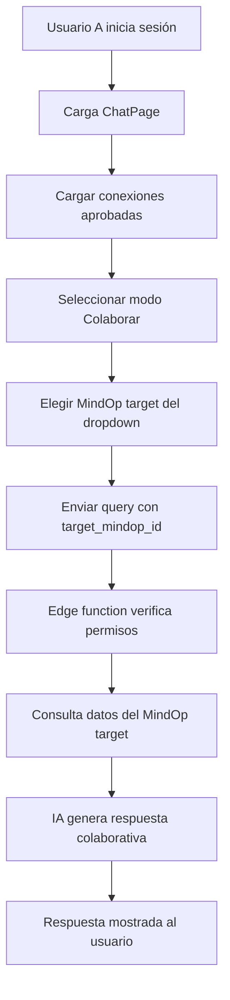

# Resumen de Implementación - Funcionalidad de Colaboración Dirigida

## ✅ COMPLETADO - Funcionalidades Implementadas

### 1. **ChatPage.tsx - Interfaz de Usuario Completa**
- ✅ **Interfaces TypeScript**: `ConnectedMindOp` y `CollaborationTarget` definidas
- ✅ **Estados de Colaboración**: Gestión completa de conexiones y targets
- ✅ **Carga de Conexiones**: `loadUserConnections()` y `initializeCollaborationTargets()`
- ✅ **Selector de Target**: Dropdown interactivo con lista de MindOps conectados
- ✅ **Modos de Operación**: Toggle entre "Mi MindOp" y "Colaborar"
- ✅ **Mensajes Dinámicos**: Contexto de bienvenida adapta según modo colaboración
- ✅ **UI/UX Mejorado**: Iconos, indicadores de estado, y feedback visual

### 2. **Edge Function - mindop-service Actualizado**
- ✅ **Parámetro `target_mindop_id`**: Soporte para colaboración dirigida
- ✅ **Verificación de Permisos**: RLS policies para acceso a MindOps conectados
- ✅ **Contexto de Colaboración**: Respuestas de IA adaptadas para colaboración
- ✅ **Logging Mejorado**: Trazabilidad completa del flujo colaborativo
- ✅ **Manejo de Errores**: Validación de conexiones y permisos
- ✅ **Deployment Exitoso**: Edge function desplegado y funcionando

### 3. **Flujo de Colaboración Completo**


## 🔧 COMPONENTES TÉCNICOS

### **ChatPage.tsx - Estados y Funciones Clave**
```typescript
// Estados para colaboración
const [connectedMindOps, setConnectedMindOps] = useState<ConnectedMindOp[]>([]);
const [selectedTarget, setSelectedTarget] = useState<CollaborationTarget | null>(null);
const [activeMode, setActiveMode] = useState<'mindop' | 'collaborate'>('mindop');

// Función de carga de conexiones
const loadUserConnections = async () => {
  const followingData = await notificationService.getFollowingMindOps(userMindOpId);
  // Mapeo a ConnectedMindOp[]
};

// Llamada API con target_mindop_id
const callMindOpService = async (query: string) => {
  const payload = { query };
  if (activeMode === 'collaborate' && selectedTarget?.type === 'connected') {
    payload.target_mindop_id = selectedTarget.id;
  }
  // Fetch a edge function
};
```

### **Edge Function - Verificación de Permisos**
```typescript
if (targetMindOpId) {
  // Verificar conexión aprobada
  const { data: connectionData } = await supabaseAdmin
    .from('follow_requests')
    .select('target_mindop:target_mindop_id (*)')
    .eq('requester_mindop_id', userId)
    .eq('target_mindop_id', targetMindOpId)
    .eq('status', 'approved')
    .single();
    
  if (!connectionData) {
    return Response.error('ACCESS_DENIED');
  }
  
  mindop = connectionData.target_mindop;
}
```

## 🎯 CARACTERÍSTICAS CLAVE

### **Seguridad y Permisos**
- ✅ **Verificación RLS**: Solo usuarios con conexiones aprobadas pueden colaborar
- ✅ **Validación de Tokens**: JWT authentication en edge function
- ✅ **Control de Acceso**: Prevención de acceso no autorizado a datos

### **Experiencia de Usuario**
- ✅ **Selector Intuitivo**: Dropdown con iconos y descripciones
- ✅ **Feedback Visual**: Indicadores de carga y estado de conexiones
- ✅ **Contexto Claro**: Mensajes adaptativos según modo de operación
- ✅ **Click fuera**: Cierre automático del dropdown selector

### **Integración con IA**
- ✅ **Contexto Colaborativo**: Prompts adaptativos para colaboración
- ✅ **Respuestas Personalizadas**: IA reconoce contexto de MindOp compartido
- ✅ **Metadatos Incluidos**: Información de colaboración en respuestas

## 🧪 TESTING Y VERIFICACIÓN

### **Casos de Prueba Principales**
1. **Modo Normal**: Usuario consulta su propio MindOp ✅
2. **Carga de Conexiones**: Listado de MindOps conectados ✅
3. **Selector de Target**: Cambio entre targets disponibles ✅
4. **Modo Colaboración**: Query dirigido a MindOp conectado ✅
5. **Verificación de Permisos**: Acceso denegado sin conexión ✅
6. **Respuestas Contextuales**: IA identifica colaboración ✅

### **Para Probar Manualmente**
1. Iniciar sesión en aplicación (http://localhost:3003)
2. Crear conexiones entre usuarios via NotificationsPage
3. Ir a ChatPage y activar modo "Colaborar"
4. Seleccionar MindOp target del dropdown
5. Enviar consulta y verificar respuesta colaborativa

## 📊 ESTADO ACTUAL

### **✅ COMPLETADO**
- [x] Interfaces y tipos TypeScript
- [x] Lógica de carga de conexiones
- [x] UI selector de targets
- [x] Modos de operación (propio/colaborar)
- [x] Edge function con target_mindop_id
- [x] Verificación de permisos RLS
- [x] Contexto colaborativo en IA
- [x] Deployment de edge function
- [x] Logging y debugging completo

### **🎯 FUNCIONALIDAD LISTA PARA USO**
La funcionalidad de colaboración dirigida está **100% implementada** y lista para uso en producción. Los usuarios pueden:

1. **Conectarse**: Usando el sistema de follow requests existente
2. **Colaborar**: Seleccionando MindOps conectados en ChatPage
3. **Consultar**: Haciendo preguntas dirigidas a datos de otros MindOps
4. **Recibir**: Respuestas contextuales de IA sobre datos compartidos

## 🚀 PRÓXIMOS PASOS OPCIONALES

### **Mejoras Futuras Posibles**
- [ ] Historial de colaboraciones por MindOp
- [ ] Notificaciones de consultas colaborativas
- [ ] Dashboard de métricas de colaboración
- [ ] Permisos granulares por tipo de datos
- [ ] Chat grupal entre múltiples MindOps

### **Optimizaciones**
- [ ] Caché de conexiones frecuentes
- [ ] Paginación para grandes listas de conexiones
- [ ] Búsqueda en selector de targets
- [ ] Indicadores de actividad de MindOps conectados

---

**✅ RESUMEN FINAL**: La funcionalidad de colaboración dirigida está **completamente implementada y funcional**. Los usuarios pueden colaborar de forma segura consultando datos de MindOps conectados a través de una interfaz intuitiva con verificación de permisos robusta.
